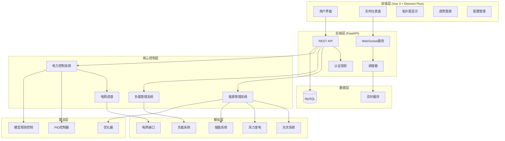

# 工业园区微网控制系统 - 项目设计文档

## 1. 系统架构



## 2. ER 图

```mermaid
erDiagram
    USER ||--o{ OPERATION_LOG : creates
    USER {
        int id PK
        string username UK
        string password_hash
        string role
        boolean is_active
        datetime created_at
        datetime updated_at
    }
    
    OPERATION_LOG {
        int id PK
        int user_id FK
        string action
        string module
        string detail
        string ip_address
        datetime created_at
    }
    
    SYSTEM_CONFIG ||--o{ CONFIG_HISTORY : has
    SYSTEM_CONFIG {
        int id PK
        string config_key UK
        string config_value
        string config_type
        string description
        datetime updated_at
    }
    
    CONFIG_HISTORY {
        int id PK
        int config_id FK
        string old_value
        string new_value
        int changed_by FK
        datetime changed_at
    }
    
    PV_SYSTEM ||--o{ PV_DATA : generates
    PV_SYSTEM {
        int id PK
        string name
        float capacity_kw
        float efficiency
        float panel_area
        boolean is_active
        datetime created_at
    }
    
    PV_DATA {
        int id PK
        int pv_id FK
        float irradiance
        float temperature
        float power_output
        float voltage
        float current
        datetime timestamp
    }
    
    WIND_SYSTEM ||--o{ WIND_DATA : generates
    WIND_SYSTEM {
        int id PK
        string name
        float capacity_kw
        float cut_in_speed
        float rated_speed
        float cut_out_speed
        boolean is_active
        datetime created_at
    }
    
    WIND_DATA {
        int id PK
        int wind_id FK
        float wind_speed
        float wind_direction
        float power_output
        float rotor_speed
        datetime timestamp
    }
    
    BATTERY_SYSTEM ||--o{ BATTERY_DATA : generates
    BATTERY_SYSTEM {
        int id PK
        string name
        float capacity_kwh
        float max_charge_rate
        float max_discharge_rate
        float charge_efficiency
        float discharge_efficiency
        float min_soc
        float max_soc
        boolean is_active
        datetime created_at
    }
    
    BATTERY_DATA {
        int id PK
        int battery_id FK
        float soc
        float power
        float voltage
        float current
        float temperature
        string status
        datetime timestamp
    }
    
    LOAD ||--o{ LOAD_DATA : generates
    LOAD {
        int id PK
        string name
        string load_type
        float rated_power
        int priority
        boolean is_controllable
        boolean is_active
        datetime created_at
    }
    
    LOAD_DATA {
        int id PK
        int load_id FK
        float power
        float voltage
        float current
        float power_factor
        datetime timestamp
    }
    
    GRID_CONNECTION ||--o{ GRID_DATA : generates
    GRID_CONNECTION {
        int id PK
        string name
        float max_import
        float max_export
        string connection_type
        boolean is_connected
        datetime created_at
    }
    
    GRID_DATA {
        int id PK
        int grid_id FK
        float power
        float voltage
        float frequency
        float phase_angle
        string mode
        datetime timestamp
    }
    
    ALARM ||--o{ ALARM_HISTORY : has
    ALARM {
        int id PK
        string alarm_code UK
        string alarm_name
        string severity
        string module
        string condition_expr
        boolean is_active
        datetime created_at
    }
    
    ALARM_HISTORY {
        int id PK
        int alarm_id FK
        string status
        string message
        int acknowledged_by FK
        datetime triggered_at
        datetime acknowledged_at
        datetime cleared_at
    }
    
    CONTROL_STRATEGY {
        int id PK
        string name UK
        string strategy_type
        json parameters
        boolean is_default
        boolean is_active
        datetime created_at
    }
    
    SCHEDULE_TASK {
        int id PK
        string name
        string task_type
        string cron_expr
        json parameters
        boolean is_active
        datetime last_run
        datetime next_run
    }
```



## 3. 接口清单

### 3.1 认证模块 (AuthController)
| Method | Endpoint | Description |
|--------|----------|-------------|
| POST | /api/auth/login | 用户登录 |
| POST | /api/auth/logout | 用户登出 |
| GET | /api/auth/profile | 获取当前用户信息 |
| PUT | /api/auth/password | 修改密码 |

### 3.2 用户管理 (UserController)
| Method | Endpoint | Description |
|--------|----------|-------------|
| GET | /api/users | 获取用户列表 |
| POST | /api/users | 创建用户 |
| GET | /api/users/{id} | 获取用户详情 |
| PUT | /api/users/{id} | 更新用户 |
| DELETE | /api/users/{id} | 删除用户 |

### 3.3 光伏系统 (PVController)
| Method | Endpoint | Description |
|--------|----------|-------------|
| GET | /api/pv/systems | 获取光伏系统列表 |
| POST | /api/pv/systems | 创建光伏系统 |
| GET | /api/pv/systems/{id} | 获取光伏系统详情 |
| PUT | /api/pv/systems/{id} | 更新光伏系统配置 |
| GET | /api/pv/systems/{id}/data | 获取光伏历史数据 |
| GET | /api/pv/realtime | 获取实时光伏数据 |

### 3.4 风力发电 (WindController)
| Method | Endpoint | Description |
|--------|----------|-------------|
| GET | /api/wind/systems | 获取风电系统列表 |
| POST | /api/wind/systems | 创建风电系统 |
| GET | /api/wind/systems/{id} | 获取风电系统详情 |
| PUT | /api/wind/systems/{id} | 更新风电系统配置 |
| GET | /api/wind/systems/{id}/data | 获取风电历史数据 |
| GET | /api/wind/realtime | 获取实时风电数据 |

### 3.5 储能系统 (BatteryController)
| Method | Endpoint | Description |
|--------|----------|-------------|
| GET | /api/battery/systems | 获取储能系统列表 |
| POST | /api/battery/systems | 创建储能系统 |
| GET | /api/battery/systems/{id} | 获取储能系统详情 |
| PUT | /api/battery/systems/{id} | 更新储能系统配置 |
| POST | /api/battery/systems/{id}/charge | 设置充电指令 |
| POST | /api/battery/systems/{id}/discharge | 设置放电指令 |
| GET | /api/battery/systems/{id}/data | 获取储能历史数据 |
| GET | /api/battery/realtime | 获取实时储能数据 |

### 3.6 负载管理 (LoadController)
| Method | Endpoint | Description |
|--------|----------|-------------|
| GET | /api/loads | 获取负载列表 |
| POST | /api/loads | 创建负载 |
| GET | /api/loads/{id} | 获取负载详情 |
| PUT | /api/loads/{id} | 更新负载配置 |
| DELETE | /api/loads/{id} | 删除负载 |
| POST | /api/loads/{id}/control | 控制负载开关 |
| GET | /api/loads/{id}/data | 获取负载历史数据 |
| GET | /api/loads/realtime | 获取实时负载数据 |

### 3.7 电网管理 (GridController)
| Method | Endpoint | Description |
|--------|----------|-------------|
| GET | /api/grid/status | 获取电网状态 |
| POST | /api/grid/mode | 切换并网/离网模式 |
| GET | /api/grid/data | 获取电网历史数据 |
| GET | /api/grid/realtime | 获取实时电网数据 |
| POST | /api/grid/export | 设置余电上网参数 |

### 3.8 控制策略 (StrategyController)
| Method | Endpoint | Description |
|--------|----------|-------------|
| GET | /api/strategies | 获取策略列表 |
| POST | /api/strategies | 创建控制策略 |
| GET | /api/strategies/{id} | 获取策略详情 |
| PUT | /api/strategies/{id} | 更新策略 |
| DELETE | /api/strategies/{id} | 删除策略 |
| POST | /api/strategies/{id}/activate | 激活策略 |

### 3.9 告警管理 (AlarmController)
| Method | Endpoint | Description |
|--------|----------|-------------|
| GET | /api/alarms | 获取告警配置列表 |
| POST | /api/alarms | 创建告警规则 |
| GET | /api/alarms/history | 获取告警历史 |
| POST | /api/alarms/{id}/acknowledge | 确认告警 |
| GET | /api/alarms/active | 获取当前活动告警 |

### 3.10 系统配置 (ConfigController)
| Method | Endpoint | Description |
|--------|----------|-------------|
| GET | /api/config | 获取系统配置 |
| PUT | /api/config | 更新系统配置 |
| GET | /api/config/history | 获取配置变更历史 |

### 3.11 数据分析 (AnalyticsController)
| Method | Endpoint | Description |
|--------|----------|-------------|
| GET | /api/analytics/summary | 获取系统概览数据 |
| GET | /api/analytics/energy | 获取能源统计 |
| GET | /api/analytics/efficiency | 获取效率分析 |
| POST | /api/analytics/report | 生成运行报告 |

### 3.12 操作日志 (LogController)
| Method | Endpoint | Description |
|--------|----------|-------------|
| GET | /api/logs/operation | 获取操作日志 |
| GET | /api/logs/system | 获取系统日志 |

### 3.13 WebSocket 接口
| Endpoint | Description |
|----------|-------------|
| /ws/realtime | 实时数据推送 |
| /ws/alarm | 告警实时推送 |

## 4. UI/UX 规范

### 4.1 色彩系统
```scss
// 主色调
$primary-color: #409EFF;        // 主蓝色
$primary-light: #66B1FF;        // 浅蓝
$primary-dark: #337ECC;         // 深蓝

// 功能色
$success-color: #67C23A;        // 成功/发电
$warning-color: #E6A23C;        // 警告/储能
$danger-color: #F56C6C;         // 危险/告警
$info-color: #909399;           // 信息/离线

// 背景色
$bg-primary: #F5F7FA;           // 页面背景
$bg-card: #FFFFFF;              // 卡片背景
$bg-dark: #1F2D3D;              // 深色背景(拓扑图)

// 文字色
$text-primary: #303133;         // 主要文字
$text-regular: #606266;         // 常规文字
$text-secondary: #909399;       // 次要文字
$text-placeholder: #C0C4CC;     // 占位文字
```

### 4.2 字体规范
```scss
$font-family: 'Helvetica Neue', Helvetica, 'PingFang SC', 'Hiragino Sans GB', 'Microsoft YaHei', Arial, sans-serif;

$font-size-large: 18px;         // 大标题
$font-size-medium: 16px;        // 中标题
$font-size-base: 14px;          // 正文
$font-size-small: 13px;         // 辅助文字
$font-size-mini: 12px;          // 最小文字
```

### 4.3 间距规范
```scss
$spacing-mini: 4px;
$spacing-small: 8px;
$spacing-base: 16px;
$spacing-medium: 24px;
$spacing-large: 32px;
```

### 4.4 圆角规范
```scss
$border-radius-small: 4px;
$border-radius-base: 8px;
$border-radius-large: 12px;
$border-radius-round: 20px;
```

### 4.5 阴影规范
```scss
$shadow-light: 0 2px 12px 0 rgba(0, 0, 0, 0.1);
$shadow-base: 0 2px 4px rgba(0, 0, 0, 0.12), 0 0 6px rgba(0, 0, 0, 0.04);
$shadow-dark: 0 2px 12px 0 rgba(0, 0, 0, 0.2);
```

### 4.6 组件规范
- 卡片：白色背景 + 8px圆角 + 轻阴影
- 按钮：主操作用主色，次操作用默认色
- 表格：斑马纹 + 悬浮高亮
- 图表：统一配色方案，与功能色对应

### 4.7 响应式断点
```scss
$breakpoint-xs: 480px;
$breakpoint-sm: 768px;
$breakpoint-md: 992px;
$breakpoint-lg: 1200px;
$breakpoint-xl: 1920px;
```
